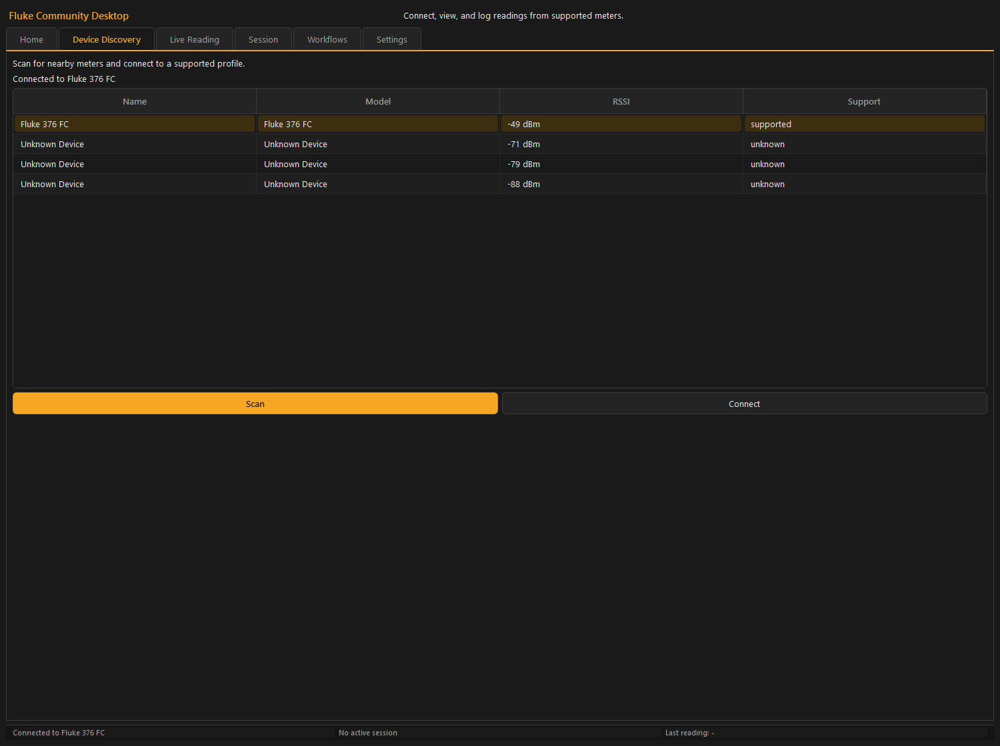

# Fluke Community Desktop

Open desktop app, CLI, and Python SDK for working with BLE-enabled Fluke meters from a shared architecture.

This is an unofficial community project. It is not affiliated with, endorsed by, or sponsored by Fluke Corporation. `Fluke` is a trademark of its respective owner.

The repo contains a more structured codebase built around:

- canonical domain models
- profile-based protocol decoding
- shared application services
- SQLite session logging
- desktop and CLI surfaces on top of the same services
- guided workflow execution
- an extension boundary for future contributed profiles and workflow packs

The current in-tree device focus is still the Fluke 376 FC.

The project is released under the [MIT License](LICENSE).

For a structured documentation set instead of this high-level overview, start with [docs/README.md](docs/README.md).

## Screenshots

### Device Discovery



### Live Reading


### Advanced Clamp Live


### Session And Device Memory


### Workflows


## Project Status

What exists now:

- BLE scan, connect, and stream path through shared services
- automatic reconnection with session continuation: an unexpected drop retries
  with exponential backoff + jitter (configurable), keeps the active recording
  session open, and inserts `connection_lost` / `connection_restored` gap markers
  so outages are visible in replay and exports; surfaced through the shared event
  bus to desktop (Live Reading banner + Settings toggle), CLI (`--no-reconnect`),
  and the SDK (`ReconnectPolicy`)
- normalized `Reading` model and 376 FC profile decoder
- SQLite session, marker, workflow-run, and export support
- desktop app with discovery, live view, charting, replay, markers, session export, and workflow runner
  - live view supports rolling and derived chart modes without rewriting stored data
  - session replay filters mixed-mode sessions into cleaner measurement views without rewriting raw data
  - session replay supports elapsed-time, UTC, and per-segment chart axes
  - desktop session exports include raw CSV/JSON plus analysis CSV and segment-summary JSON
  - workflow steps support manual, stable-capture, countdown, and observe-and-confirm interaction modes
  - workflow capture steps support pass/fail acceptance criteria (absolute min/max plus relative percent-within, percent-drop, and phase-unbalance checks) with per-step and overall run verdicts
  - workflow run history can be reviewed and exported as Markdown or professional PDF job reports from the desktop UI and CLI
  - optional asset tracking: attach sessions to equipment and trend a piece of gear's min/max/avg/median readings over time, with trend chart and CSV export
- shared alerting (`AlertEvaluator`) with high/low thresholds, out-of-band duration debounce, and reading-status / connection alerts, surfaced in both the CLI and desktop app (banner, beep, OS notification, and session markers)
- spoken readings (text-to-speech) via a platform-native backend abstraction, with interval / on-stable / on-change / on-alert modes in the CLI and desktop
- optional MQTT publishing (`.[mqtt]`) of readings plus availability (LWT) and Home Assistant MQTT Discovery, available from the CLI and SDK
- LAN-only live web view (`fluke serve`) so a helper can watch the live reading on their phone browser, no cloud or accounts
- CLI for scan, stream, watch, alert, serve, log, sessions, workflows, plugins, fixture capture, BLE probing, and debug bundle export
- Python SDK on the same core stack
- plugin loader for contributed profiles and workflow JSON packs
- hardware-free test coverage using fake BLE adapters and replay frames

What still needs repeated real-hardware validation:

- longer-duration BLE sessions on the rebuilt stack
- automatic reconnection is currently validated only against the fake BLE adapter
  (scripted drops and reconnect outcomes); backoff timing, reconnect success rate,
  and session-continuation behavior against real meters and real BLE stacks still
  need repeated on-hardware validation before the support matrix is relaxed
- packaged installer behavior
- additional model support beyond the 376 FC

## Guiding Methodology

This repo intentionally avoids "desktop-only" or "CLI-only" logic.

The development order has been:

1. normalize protocol payloads into canonical readings
2. persist sessions and make exports reliable
3. expose the same behavior through CLI, desktop, and SDK
4. add charts, workflows, and contributor tooling only after the core path was solid

That methodology matters. If you add a new capability, add it to the shared stack first unless there is a very strong reason not to.

## Repository Map

```text
apps/
  cli/                  Command-line entry points
  desktop/              PySide6 desktop application
packages/
  fluke_app/            Shared orchestration services
  fluke_ble/            BLE transport abstraction + Bleak adapter
  fluke_core/           Domain models, enums, statistics, workflow models
  fluke_plugins/        Plugin discovery and extension loading
  fluke_protocol/       Device profile registry and protocol decoding
  fluke_sdk/            Public Python SDK
  fluke_store/          SQLite schema and repositories
  fluke_testing/        Fake adapters, replay tools, fixture capture helpers
plugins/
  examples/             Disabled template plugin for contributors
workflows/              Built-in workflow definitions
scripts/
  fixture_capture.py    Raw fixture capture helper
  export_debug_bundle.py
docs/
  README.md               Documentation hub
  architecture.md
  getting-started.md
  desktop-guide.md
  cli-guide.md
  data-and-exports.md
  sdk-guide.md
  workflows-page.md
  support-matrix.md
  developer/
```

## Requirements

- Python 3.11+
- BLE-capable host
- virtual environment recommended
- `bleak` for BLE runtime
- `PySide6` for the desktop UI

Minimal dependency set:

- `requirements.txt`: CLI + SDK + BLE runtime

Full contributor / desktop dependency set:

- `requirements-full.txt`: desktop, plotting, dashboard/data extras, plus the base BLE runtime
- package extras are also available through `pyproject.toml`:
  - `.[desktop]`: desktop UI and charting
  - `.[reports]`: PDF job/session report generation (`reportlab`)
  - `.[mqtt]`: MQTT publishing / Home Assistant discovery (`paho-mqtt`)
  - `.[speech]`: optional cross-platform TTS backend (`pyttsx3`); native engines need no extra
  - `.[web]`: LAN live web view (`fluke serve`): `aiohttp` + optional `qrcode`
  - `.[full]`: desktop plus the current optional extras used in the repo (includes reports, MQTT, and web)
  - `.[dev]`: same dependency set as `.[full]` for contributors and CI

## Installation

### Packaged installer (recommended for end users)

If you just want to run the desktop app and do not work in Python, use a
prebuilt installer. No Python install is required.

1. Open the project's [GitHub Releases](../../releases) page.
2. Download the asset for your platform:
   - Windows: `FlukeCommunity-<version>-Setup.exe`
   - macOS: `FlukeCommunity-<version>.dmg`
3. Install:
   - Windows: run the `Setup.exe` (a per-user install, no admin rights needed)
     and launch `Fluke Community` from the Start menu.
   - macOS: open the `.dmg` and drag `Fluke Community` to `Applications`. The
     build is currently unsigned, so on first launch right-click the app and
     choose **Open** to get past Gatekeeper.

The rest of this section describes the source install for developers and
contributors. To build the installers yourself, see
[packaging/README.md](packaging/README.md).

### Full install (desktop + CLI + SDK)

macOS / Linux:

```bash
python3 -m venv .venv
source .venv/bin/activate
python -m pip install --upgrade pip
python -m pip install -e ".[full]"
```

Windows PowerShell:

```powershell
python -m venv .venv
.\.venv\Scripts\Activate.ps1
python -m pip install --upgrade pip
python -m pip install -e ".[full]"
```

### Minimal install (CLI + SDK only)

```bash
python -m pip install -e .
```

If you prefer requirements files over package extras, the legacy commands still work:

- minimal: `python -m pip install -r requirements.txt && python -m pip install -e .`
- full: `python -m pip install -r requirements-full.txt && python -m pip install -e .`

The editable install provides these entry points from `pyproject.toml`:

- `fluke`
- `fluke-cli`
- `fluke-desktop`

If you skip `python -m pip install -e .`, use the module entry points directly:

- `python -m apps.cli.main`
- `python -m apps.desktop.main`

Install expectations:

- minimal install supports the CLI and SDK paths
- desktop usage requires the desktop/full extras or `requirements-full.txt`
- the full automated test suite also expects the desktop/full dependency set

## Running The App

### CLI

Installed entry point:

```bash
fluke --help
```

Module fallback:

```bash
python -m apps.cli.main --help
```

Global flags:

- `--version`
- `-v` / `--verbose`
- `--json` for commands that support structured output

### Desktop

Installed entry point:

```bash
fluke-desktop
```

Module fallback:

```bash
python -m apps.desktop.main
```

On macOS, the desktop app uses `PySide6.QtAsyncio` for Qt/BLE event-loop integration. Other platforms continue to use the background async runner.

### Python SDK

Example:

```python
import asyncio

from fluke_sdk import FlukeClient


async def main() -> None:
    client = FlukeClient()
    devices = await client.scan(timeout_s=5.0)
    if not devices:
        print("No devices found.")
        return

    device = await client.connect(devices[0].device_id)
    print(device)

    async for reading in client.stream_readings():
        print(reading.display_text)
        break

    await client.close()


asyncio.run(main())
```

## CLI Quickstart

### 1. Scan for nearby devices

```bash
fluke scan --timeout 10 --name Fluke
```

### 2. Stream readings

Plain text stream:

```bash
fluke stream --device "<DEVICE_ID>" --profile fluke_376fc
```

Retro terminal dashboard:

```bash
fluke stream --device "<DEVICE_ID>" --profile fluke_376fc --dashboard
```

Additional live terminal views:

```bash
fluke watch --device "<DEVICE_ID>" --profile fluke_376fc
fluke alert --device "<DEVICE_ID>" --profile fluke_376fc --high 120
```

LAN live web view for a second person on a phone (trusted LAN only, read-only):

```bash
fluke serve --device "<DEVICE_ID>" --profile fluke_376fc
```

This prints the LAN URLs plus a scannable QR code and serves a mobile-first live
page over WebSocket. See [docs/web-live-view.md](docs/web-live-view.md).

### 3. Log to SQLite and optionally export

```bash
fluke log \
  --device "<DEVICE_ID>" \
  --profile fluke_376fc \
  --duration 30 \
  --title "Bench run" \
  --notes "Initial validation" \
  --csv-output exports/session.csv \
  --json-output exports/session.json
```

### 4. Inspect recorded sessions

```bash
fluke sessions list
fluke sessions export --session "<SESSION_ID>" --format json --output exports/session.json
```

### 5. Browse or run workflows

```bash
fluke workflow list
fluke workflow run --workflow battery_pack_check_v1 --device "<DEVICE_ID>" --profile fluke_376fc
```

### 6. Track equipment and trend readings

```bash
fluke assets create --name "Line 3 Motor" --type motor --location "Bay 2"
fluke log --device "<DEVICE_ID>" --asset "<ASSET_ID>" --duration 30
fluke assets trend --asset "<ASSET_ID>" --measurement current_inrush
```

### 7. Structured output

The `--json` flag is global, so place it before the subcommand:

```bash
fluke --json devices supported
fluke --json scan --timeout 5
fluke --json sessions list
fluke --json workflow list
```

### 8. Plugins and diagnostics

```bash
fluke plugins list
fluke fixtures capture --device "<DEVICE_ID>" --profile fluke_376fc --duration 10 --output fixtures/capture.json
fluke debug probe --device "<DEVICE_ID>" --read --notify-seconds 5 --output artifacts/probe.json
fluke debug bundle --output artifacts/debug-bundle.zip
```

### Default database path

When `--database` is omitted, commands use a platform-appropriate default path:

- macOS: `~/Library/Application Support/fluke-community/fluke.db`
- Linux: `~/.local/share/fluke-community/fluke.db`
- Windows: `%LOCALAPPDATA%/fluke-community/fluke.db`

The default path is resolved lazily, so commands such as `fluke --version` do not create directories or touch the database.

## Desktop Workflow

The desktop app currently includes:

- Home
- Device Discovery
- Live Reading
- Session
- Workflows
- Assets
- Settings

### Live Reading

The Live Reading tab supports:

- current reading display
- unit and measurement type
- live chart
- chart mode selector
- min / max / avg / sample summary
- session start / stop
- manual session markers
- live chart PNG export

The live chart now keeps a larger timestamped buffer and derives the visible plot from the selected chart mode:

- `Rolling 30s`
- `Rolling 60s`
- `Rolling 5m`
- `Since mode start`
- `Since session start`

When the meter changes measurement context, the live view starts a new derived segment and shows a transient banner. Changing chart mode also starts a new `Since mode start` boundary instead of discarding buffered readings.

### Session

The Session tab supports:

- recent sessions
- replay chart
- measurement-view filtering for mixed-mode sessions
- axis mode selection for `Elapsed Time`, `UTC Timestamp`, and `By Segment`
- per-segment selection when viewing a derived segment axis
- marker review
- session notes
- `Export Raw CSV`
- `Export Raw JSON`
- `Export Analysis CSV`
- `Export Segment Summary JSON`
- chart PNG export

Replay filtering is derived in the UI layer rather than rewriting stored data:

- raw readings stay stored exactly as captured
- compatible unit ranges are grouped into cleaner replay views
- mode is only retained where it is meaningful for replay
- tiny transitional / unknown groups are suppressed from the filter UI
- `All Measurements` remains available as a mixed-session overview

### Workflows

The Workflows tab supports:

- selecting a built-in workflow
- starting a workflow run against the active session stack
- completing, continuing, retaking, skipping, or canceling steps
- per-step interaction modes:
  - `manual_check`
  - `stable_capture`
  - `countdown_capture`
  - `observe_and_confirm`
- capture steps that validate the current live reading type / unit
- staged capture confirmation for pause-after-capture steps
- recent workflow run history stored in SQLite
- selecting recent runs to review historical step results
- pass/fail verdicts shown per step and for the overall run
- in-app workflow reports for the selected run
- Markdown export and professional PDF job-report export of workflow run reports

Built-in workflow packs:

- Battery Pack Check
- Solar Panel Test
- Charger Output Check
- Continuity Checklist
- Motor Inrush Baseline
- Voltage Drop Under Load
- Three-Phase Balance Survey
- HVAC Capacitor Check
- HVAC Amp Draw vs Nameplate
- EV Charger (EVSE) Output Check
- Solar String Open-Circuit Voltage Check
- Receptacle Branch Circuit Survey

### Assets

The Assets tab supports maintenance-style equipment tracking:

- create / edit / delete tracked assets (name, type, location, notes)
- attach a session to an asset when starting logging (Live Reading tab) or retroactively (Session tab)
- per-asset trend chart (x = session date, y = chosen stat) with a measurement selector and min / max / avg / median selector
- trend chart PNG export and per-session trend CSV export

Assets are optional. If you never create one, capture, session, and export behavior are unchanged, and sessions recorded before the feature stay unassigned. See [docs/assets-and-trending.md](docs/assets-and-trending.md).

## Workflows

Workflow definitions are data-driven JSON files under `workflows/`.

Example shape:

```json
{
  "workflow_id": "battery_pack_check_v1",
  "title": "Battery Pack Check",
  "steps": [
    {
      "id": "measure_total_voltage",
      "instruction": "Measure total pack voltage.",
      "interaction_mode": "stable_capture",
      "advance_on_capture": false,
      "capture": true,
      "capture_settings": {
        "stable_for_s": 0.75,
        "min_samples": 5,
        "relative_tolerance": 0.01
      },
      "expected_measurement_type": "voltage_dc",
      "expected_unit": "V"
    }
  ]
}
```

Legacy workflow JSON that only uses `capture: true/false` still loads. New workflow definitions should prefer explicit `interaction_mode`, `advance_on_capture`, and `capture_settings`.

## Plugin Boundary

The project now includes a lightweight plugin loader in `packages/fluke_plugins/`.

Plugins can contribute:

- new `DeviceProfile` implementations
- additional workflow JSON directories
- fixture directories

Discovery root:

```text
plugins/
```

See:

- [plugins/README.md](plugins/README.md)
- [docs/developer/new-device-profile.md](docs/developer/new-device-profile.md)
- `plugins/examples/example_profile_plugin/`

Important note: the built-in `fluke_376fc` path still ships from the core codebase. Plugins are currently additive and intended for experimentation and contribution.

## Diagnostics And Contributor Tooling

### Raw fixture capture

- CLI: `fluke fixtures capture`
- script: `scripts/fixture_capture.py`

### Debug bundle export

- CLI: `fluke debug bundle`
- script: `scripts/export_debug_bundle.py`

### BLE probe

- CLI: `fluke debug probe`
- captures connected GATT services, characteristic properties, optional reads, and optional notification samples

These are meant to lower the barrier for remote debugging when hardware is unavailable.

## Data Model Summary

### Reading

- timestamp
- value
- unit
- measurement type
- status
- display text
- source device

### Session

- title
- notes
- tags
- device id
- start / end time
- profile id
- optional asset id

### Asset

- name
- asset type (free text, suggested categories like motor/panel/HVAC unit/battery/charger)
- location
- notes
- created at

### Marker

- session id
- timestamp
- label
- note

### Workflow Run

- workflow id
- session id
- start / end time
- run result

## Testing

Quick regression suite used during active development:

```bash
python -m unittest tests.unit.test_cli_main tests.unit.test_desktop_presenter tests.unit.test_desktop_views tests.unit.test_sdk_client
```

Full suite:

```bash
python -m pip install -e ".[dev]"
python -m unittest discover -s tests -p "test_*.py"
python -m compileall apps packages tests
```

Minimal CLI/SDK-only verification:

```bash
python -m pip install -e .
python -m unittest tests.unit.test_cli_main tests.unit.test_sdk_client tests.unit.test_fluke_376fc_profile tests.unit.test_fake_adapter_and_stream tests.unit.test_logging_flow tests.unit.test_workflow_catalog tests.unit.test_workflow_runner tests.unit.test_capture_export tests.unit.test_debug_bundle tests.unit.test_fixture_capture_tool tests.unit.test_plugin_loader tests.unit.test_statistics tests.unit.test_store_paths
```

The test strategy is intentionally layered:

- parser and statistics unit tests
- fake-adapter integration tests
- desktop presenter tests without hardware
- workflow runner tests
- plugin loader tests
- fixture capture and debug bundle tests
- the full suite requires the desktop/full dependency set because desktop tests import `PySide6`

## Troubleshooting

### No devices found during scan

Check the basics first:

- the meter is powered on and advertising over BLE
- Bluetooth is enabled on the host
- the device is in range
- another app is not already holding the BLE connection
- you are using the expected profile for the device you are testing

Useful first commands:

```bash
fluke scan --timeout 10
fluke --json devices supported
```

### Connect works poorly or drops during streaming

Common causes:

- the meter is too far away from the computer
- another app or vendor utility is still connected to the meter
- the host Bluetooth adapter is unstable or power-managed aggressively
- the measurement mode changed and you are expecting the previous live context
- the environment has not had repeated long-duration validation yet

If the desktop app disconnects unexpectedly, it will attempt automatic reconnect. If reconnect fails, logging stops and any active workflow is canceled.

### Desktop app opens but charts do not render

Check:

- `PySide6` is installed
- the desktop dependency set was installed from `requirements-full.txt`
- you launched the app from the same virtual environment where those packages were installed

Recommended install path:

```bash
python -m pip install -r requirements-full.txt
python -m pip install -e .
```

### Session export or workflow report export is missing

Check:

- the current export directory shown in the desktop `Settings` tab
- the explicit output path you passed on the CLI
- that the target directory exists or can be created

### Platform notes

#### Windows

- BLE behavior depends heavily on the Windows Bluetooth stack and adapter drivers
- if scan/connect behavior is inconsistent, update the adapter driver and retry after fully disconnecting other Bluetooth apps
- pairing is not the same as maintaining an active BLE telemetry connection; avoid assuming the OS pairing state means the stream path is free

#### macOS

- allow Bluetooth access for the terminal, IDE, or app host you are launching from
- if the desktop app starts but cannot discover devices, check Privacy & Security permissions and retry
- the desktop app uses `PySide6.QtAsyncio` on macOS, so make sure the full desktop dependency set is installed in the active environment

#### Linux

- Linux support is still marked `Unknown` in the support matrix because adapter/runtime validation is limited
- make sure the host Bluetooth stack is running and the adapter is not blocked by `rfkill`
- desktop behavior may also depend on local `dbus` and Bluetooth service configuration

For more first-run guidance, see [docs/getting-started.md](docs/getting-started.md) and [docs/support-matrix.md](docs/support-matrix.md).

## Documentation Index

- [docs/README.md](docs/README.md)
- [docs/getting-started.md](docs/getting-started.md)
- [docs/desktop-guide.md](docs/desktop-guide.md)
- [docs/cli-guide.md](docs/cli-guide.md)
- [docs/assets-and-trending.md](docs/assets-and-trending.md)
- [docs/web-live-view.md](docs/web-live-view.md)
- [docs/data-and-exports.md](docs/data-and-exports.md)
- [docs/integrations.md](docs/integrations.md)
- [docs/sdk-guide.md](docs/sdk-guide.md)
- [docs/workflows-page.md](docs/workflows-page.md)
- [docs/developer/README.md](docs/developer/README.md)
- [docs/developer/development-workflow.md](docs/developer/development-workflow.md)
- [docs/developer/testing-guide.md](docs/developer/testing-guide.md)
- [docs/developer/desktop-ui-architecture.md](docs/developer/desktop-ui-architecture.md)
- [docs/architecture.md](docs/architecture.md)
- [docs/support-matrix.md](docs/support-matrix.md)
- [docs/developer/new-device-profile.md](docs/developer/new-device-profile.md)
- [docs/developer/fixtures-and-debug.md](docs/developer/fixtures-and-debug.md)
- [CONTRIBUTING.md](CONTRIBUTING.md)

## Current Roadmap Direction

Already implemented:

- shared BLE + protocol + CLI slice
- session logging and exports
- desktop live / session UX
- charts, markers, summaries, and chart export
- guided workflows
- workflow run review and reporting
- plugin boundary, fixture capture, and debug bundle export

Next likely work:

- more real hardware validation
- additional profile support
- packaging and installer work
- contributor docs expansion
