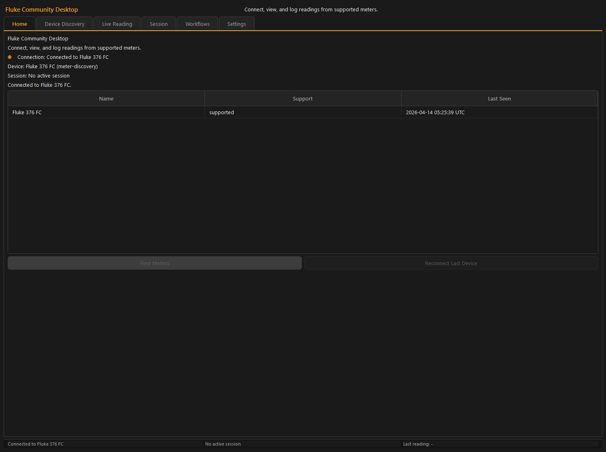
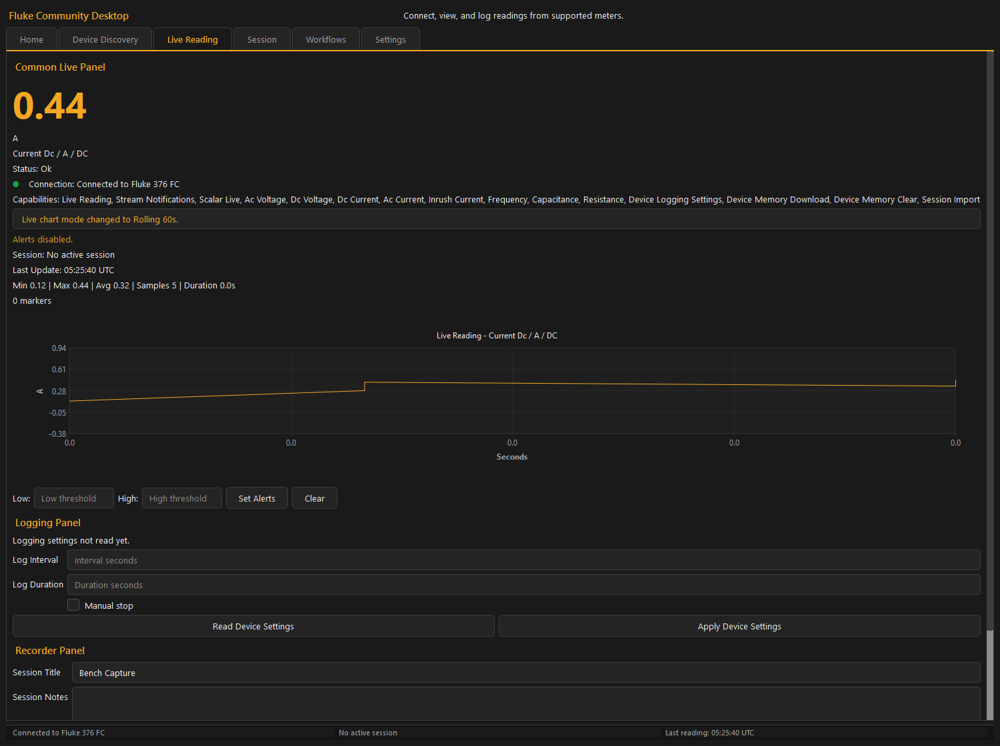
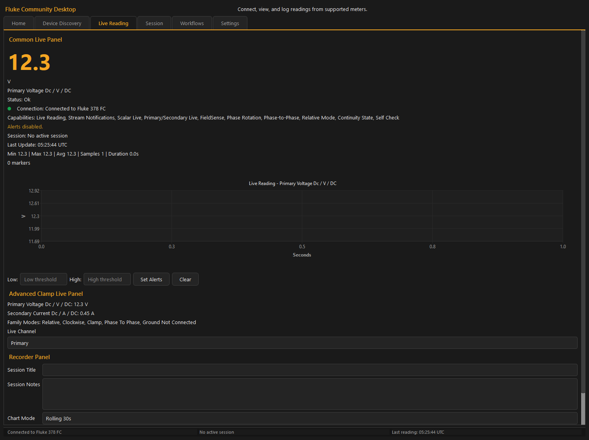
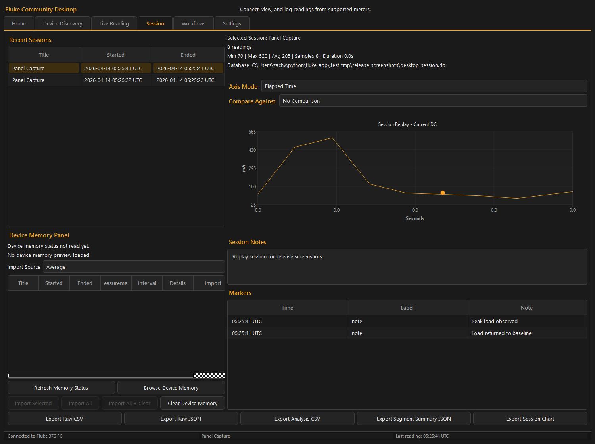
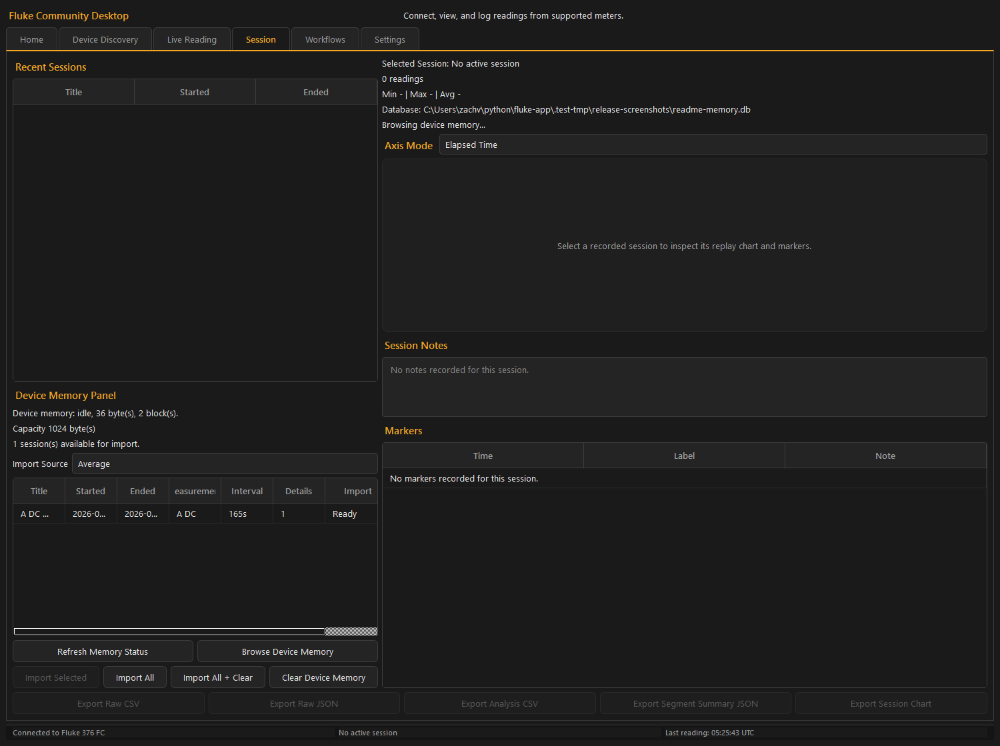
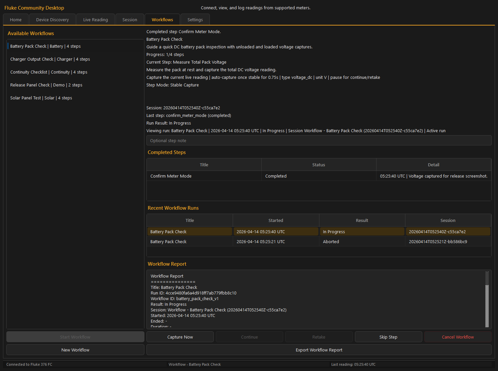
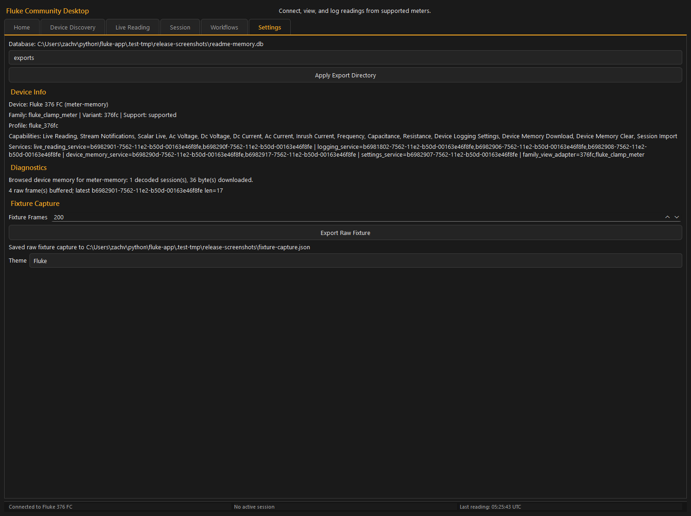

# Desktop User Guide

This guide explains how to use the PySide6 desktop application from end to end.

## Overview

The desktop app is organized into six tabs:

- `Home`
- `Device Discovery`
- `Live Reading`
- `Session`
- `Workflows`
- `Settings`

All tabs share the same runtime and database, so actions taken in one area show up immediately in the others.

Examples:

- when you start logging from `Live Reading`, the active session appears in `Home` and `Session`
- when you complete a workflow step, workflow markers appear in the current session
- when you export a session or workflow report, the export directory configured in `Settings` is used for generated desktop exports

## Global Layout

### Header

At the top of the app, the main window shows:

- application title
- short subtitle

### Status Bar

At the bottom of the app, a persistent status bar shows:

- connection status
- active session label
- the last-update timestamp from the live reading view

This bar updates continuously as the app refreshes.

## Keyboard Shortcuts

The desktop app includes several shortcuts:

- `Ctrl+1` through `Ctrl+6`: switch tabs
- `Ctrl+L`: start or stop logging from the live view
- `Ctrl+M`: focus the marker input on the live view
- `Ctrl+E`: export the selected session as raw CSV
- `Space`: trigger the primary workflow action for the current step
- `Enter`: continue after a staged workflow capture
- `R`: retake a staged workflow capture
- `Esc`: cancel the active workflow

## Home Tab

The `Home` tab is the high-level status view.

It shows:

- connection state
- active device
- active session
- recent device history
- top-level message text

Actions:

- `Find Meters`: starts a BLE scan
- `Reconnect Last Device`: reconnects to the most recently used device in local history

Use this tab when you want a quick overview without switching to the more detailed tabs.

## Device Discovery Tab

The `Device Discovery` tab is where you scan for devices and initiate a connection.

### What it shows

- scan status
- discovered devices table
- device model information
- RSSI values
- support/profile status

### Typical flow

1. Click `Scan`.
2. Wait for nearby devices to populate.
3. Select a device row.
4. Click `Connect`.

Once connected successfully, the live reading tab begins receiving stream data.

## Live Reading Tab

The `Live Reading` tab is the main real-time monitoring screen.

### What it shows

- current reading value
- advanced devices can also show primary and secondary live readings
- unit
- measurement type
- reading status
- connection state
- live chart
- chart mode selector
- alert status
- active session label
- last update time
- summary statistics
- marker count
- device logging settings controls when the connected meter supports them
- family-mode badges when the connected meter exposes richer mode state

### Session controls

The live page includes:

- `Session Title`
- `Session Notes`
- `Start Logging`
- `Stop Logging`
- `Add Marker`
- `Export Live Chart`
- `Disconnect`

If the connected device exposes device-side logging configuration, the page also includes:

- `Read Device Settings`
- `Apply Device Settings`
- interval input
- duration input
- `Manual stop`

When you click `Start Logging`, the app creates a session using the title and notes currently entered on the page.

While logging is active:

- readings are written to the shared SQLite database
- markers are stored against the active session
- session state is reflected on the `Home` and `Session` tabs

### Markers

The marker input lets you add timestamped annotations while logging.

Typical uses:

- note when a circuit was energized
- note a probe movement
- record an observation while a reading changed

Markers are later visible on the `Session` replay page.

### Alerts

The live page supports value-based threshold alerts.

Fields:

- `Low`
- `High`
- `Set Alerts`
- `Clear`

Behavior:

- if a numeric low threshold is set, readings below it trigger a low alert
- if a numeric high threshold is set, readings above it trigger a high alert
- invalid threshold text produces an alert configuration message
- if both low and high are set, low must be less than high
- new alert events cause an audible beep in the desktop UI
- new alert events are also recorded as system markers in the active session

### Live chart behavior

The live chart still focuses on one measurement context at a time, but the visible plot is now derived from a larger in-memory buffer rather than a short fixed history.

Available chart modes:

- `Rolling 30s`
- `Rolling 60s`
- `Rolling 5m`
- `Since Mode Start`
- `Since Session Start`

Important behavior:

- use the `Chart Mode` selector to change the visible rolling window without changing the stored session data
- `Rolling 30s`, `Rolling 60s`, and `Rolling 5m` are fixed rolling time ranges for the current measurement context
- meter context changes still create a new derived boundary so the chart does not mix incompatible readings
- changing chart mode shows a transient banner
- `Since Mode Start` begins at the moment the current chart mode was selected
- `Since Session Start` uses the current logging session start time when a session is active
- the app keeps enough buffered history to derive the other chart modes without rewriting stored session data

### Stale reading behavior

If the app is still connected but no new reading arrives for several seconds, the connection state is marked stale and the live page shows a warning banner that the device may be unresponsive.

### Advanced clamp devices

When a supported advanced clamp device is connected, the live page can also show:

- primary and secondary live values
- family-mode badges such as field/mode indicators
- a primary/secondary channel-aware live presentation

The primary channel remains the default charted value in the current desktop UI.

### Disconnects and reconnects

If the device disconnects unexpectedly:

- the app attempts automatic reconnect with exponential backoff and jitter
- the Live Reading tab shows a reconnecting banner with the current attempt count
- an active logging session is **not** ended; on reconnect, readings keep
  appending to the same session
- automatic `connection_lost` and `connection_restored` markers bracket the gap,
  so the outage is visible in replay and exports
- if reconnect succeeds, streaming resumes on the same session
- if reconnect ultimately fails, logging stops and active workflows are canceled

Automatic reconnect can be turned off in `Settings` under **Auto-reconnect**
(it is on by default). With it off, the first unexpected drop ends the session.

A user-initiated disconnect never triggers automatic reconnect.

The `Reconnect Last Device` action on the `Home` tab is a separate manual reconnect feature for the most recently used device.

## Session Tab

The `Session` tab is the review and export area for recorded sessions.

### What it shows

- recent session list
- selected session summary
- database path
- export status text
- replay chart
- measurement view selector
- axis mode selector
- segment selector when using segment view
- session notes
- markers table
- device-memory browser controls when the connected meter supports saved on-device sessions

### Selecting a session

When you click a session in `Recent Sessions`, the app loads:

- its recorded readings
- its markers
- its notes
- replay chart data
- any measurement context groups available for replay filtering

### Measurement View and axis controls

The session replay view can derive filtered replay groups from mixed-mode sessions.

This lets the app present cleaner chart views when a single session contains multiple measurement contexts.

Important points:

- raw stored readings are not rewritten
- the filtering is derived for replay purposes
- `All Measurements` remains the mixed-session overview
- if a session only has one meaningful replay group, the filter may not appear

Axis modes:

- `Elapsed Time`: replay points are plotted relative to the start of the selected view
- `UTC Timestamp`: replay points are plotted on an absolute UTC time axis
- `By Segment`: replay is limited to one derived segment and plotted relative to that segment's start

Derived segments are computed on demand. A new segment starts when the normalized replay context changes or when there is a gap of more than five seconds between numeric readings.

### Compare Against

The session page can overlay another recent session on the same chart when a compatible measurement context exists.

Comparison behavior:

- the selected comparison session is matched against the current measurement view
- if the selected comparison session does not contain the same replay context, the UI explains that
- if a match exists, the chart overlays both runs and the page shows delta summaries

### Notes and markers

The session page shows:

- full saved session notes
- all markers associated with the selected replay view

If no notes or markers exist, the page shows explicit empty-state placeholders.

### Exports

From the session page you can export:

- `Export Raw CSV`
- `Export Raw JSON`
- `Export Analysis CSV`
- `Export Segment Summary JSON`
- session chart PNG

The export path uses the current desktop export directory from `Settings`.

### Device memory browser

When the connected meter supports saved on-device logging memory, the session page can also browse and import that data.

Available actions can include:

- reading memory status
- browsing saved device-memory sessions
- previewing decoded sessions before import
- importing selected sessions
- importing all browsed sessions
- importing all browsed sessions and then clearing device memory
- clearing device memory directly

Imported device-memory sessions are persisted as normal sessions and then appear in the same recent-session, replay, comparison, and export flows as any other captured session.

## Workflows Tab

The `Workflows` tab handles guided procedures.

You can:

- browse available workflow definitions
- start a workflow
- complete, continue, retake, skip, or cancel steps
- cancel a workflow
- review recent workflow runs
- export a workflow report
- create a new workflow definition from the GUI

The workflow tab surfaces the current step mode, capture state, capture hint text, and the latest staged or accepted capture.

Primary action behavior depends on the current step:

- `Complete Step` for manual checklist steps
- `Confirm Step` for observe-and-confirm steps
- `Capture Now` for immediate reading capture steps
- `Start Countdown` for countdown steps that should wait before accepting a reading

Capture-oriented steps can also expose:

- `Continue` to accept a staged reading when the step pauses after capture
- `Retake` to discard the staged reading and reacquire it

The workflow builder lets you choose how each step records progress:

- `Manual Check`: no live reading required; use this for setup, safety, or checklist items
- `Observe And Confirm`: no live reading required; use this when the operator must visually verify a condition
- `Stable Capture`: waits for a valid live reading to remain stable according to the configured capture settings
- `Countdown Capture`: waits for the operator to start a countdown, then captures the live reading after that timer expires

Because workflows are a larger feature area, see [Workflows Page Guide](workflows-page.md) for the detailed behavior and authoring instructions.

## Settings Tab

The `Settings` tab exposes app-level desktop settings and diagnostics.

### What it shows

- database path
- runtime diagnostics text
- export directory input
- theme selector
- auto-reconnect toggle (on by default)
- active device/family/profile summary when connected
- active capability summary when connected
- runtime services summary when connected
- live raw-buffer/fixture status
- raw fixture export action

### Export directory

The export directory setting controls where the desktop app writes generated files when it builds export paths itself.

Examples:

- raw CSV export from the session page
- raw JSON export from the session page
- analysis CSV export from the session page
- segment summary JSON export from the session page
- session chart PNG export
- live chart PNG export
- workflow report export

Important note:

- this setting currently applies to the running app session only
- it is not persisted to a separate settings store across restarts

### Diagnostics and device info

The settings page is also the main diagnostics surface for the desktop app.

When a device is connected, it can show:

- active device id
- family and variant ids
- resolved profile
- capability summary
- runtime services summary
- connection/reconnect diagnostic text
- recent raw live-buffer status for fixture capture

Use this page when you need to confirm exactly what the app thinks is connected and which feature panels should be active.

### Themes

The desktop UI currently supports:

- `Light`
- `Dark`
- `Fluke`

Theme changes are applied live, including chart colors and status bar text styling.

As with the export directory, the current theme selection is not persisted across restarts by the settings layer at this time.

## Common Desktop Workflows

### Record a short diagnostic session

1. Open `Device Discovery`.
2. Scan and connect to the meter.
3. Open `Live Reading`.
4. Enter a title and notes.
5. Click `Start Logging`.
6. Add markers during the run if needed.
7. Click `Stop Logging`.
8. Open `Session` to review and export the result.

### Create and run a workflow

1. Open `Workflows`.
2. Click `New Workflow`.
3. Fill in the workflow metadata.
4. Add and configure ordered steps.
5. Click `Create Workflow`.
6. Select the new workflow in the workflow list.
7. Click `Start Workflow`.
8. Complete or skip steps as you work through the procedure.

### Compare two recorded sessions

1. Open `Session`.
2. Select the primary session from `Recent Sessions`.
3. Choose a `Measurement View` if the session is mixed-mode.
4. Use `Compare Against` to select another session.
5. Review the overlay chart and comparison summary text.

## Desktop Limitations and Behavior Notes

- the desktop app currently uses the shared default database path; there is no GUI control yet to change the database location
- export directory and theme changes are in-memory settings for the current run
- workflow capture steps depend on a current live reading being available
- session comparison is intentionally disabled while viewing `By Segment`
- replay filters are derived from stored readings and may be hidden if a session does not contain enough distinct replay groups

## Related Guides

- [Getting Started](getting-started.md)
- [Workflows Page Guide](workflows-page.md)
- [Data and Exports Guide](data-and-exports.md)
- [CLI Guide](cli-guide.md)
